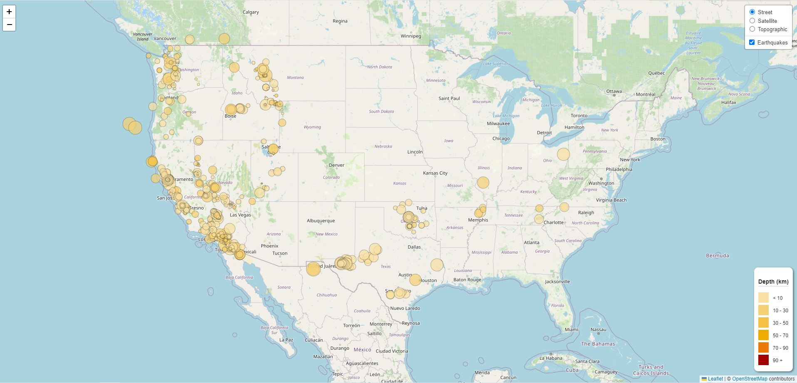

# Module 15 - Leaflet Challenge
*Leaflet Challenge  - Week 15 - Data Analytics Boot Camp - University of Oregon*

## Background
The United States Geological Survey, or USGS for short, is responsible for providing scientific data about natural hazards, the health of our ecosystems and environment, and the impacts of climate and land-use change. Their scientists develop new methods and tools to supply timely, relevant, and useful information about the Earth and its processes.

The USGS is interested in building a new set of tools that will allow them to visualize their earthquake data. They collect a massive amount of data from all over the world each day, but they lack a meaningful way of displaying it. In this challenge, I have been tasked with developing a way to visualize USGS data that will allow them to better educate the public and other government organizations (and hopefully secure more funding) on issues facing our planet.

## Instructions

- Access the geojson API from USGS GeoJSON Feed(http://earthquake.usgs.gov/earthquakes/feed/v1.0/geojson.php) using D3 to pull data from the last 7 days.
- Create an interactive map using Leaflet(https://leafletjs.com/).
    - Marker size corresponds to earthquake magnitude.
    - Color indiates depth.  Include a legend.
    - Marker popups include relevant information to the event.

## Results

